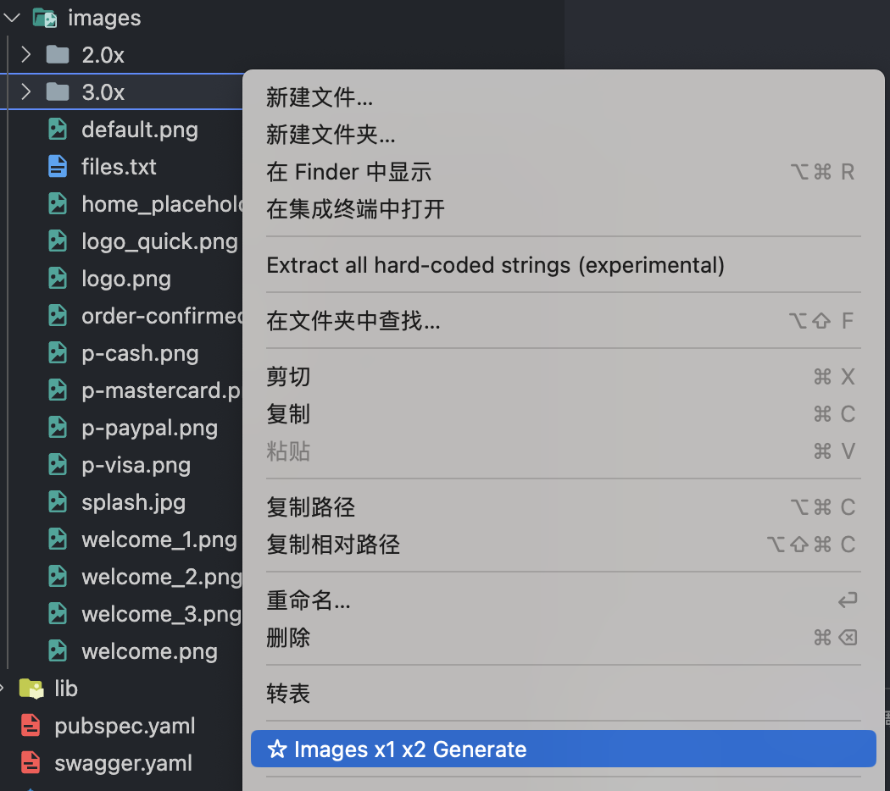
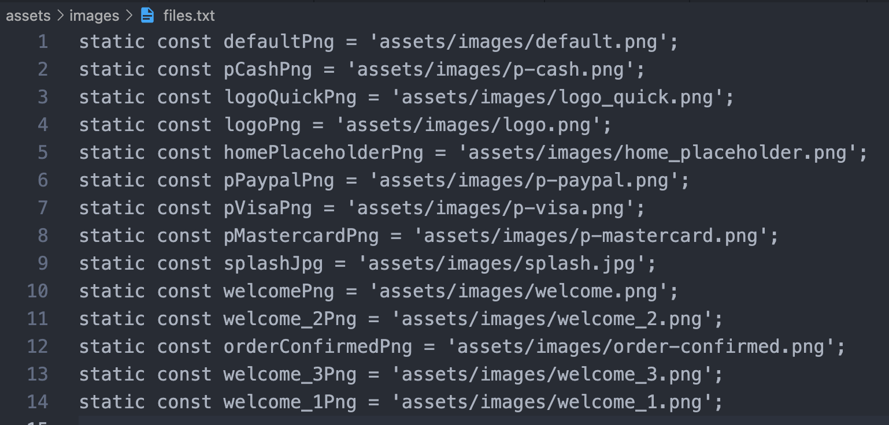
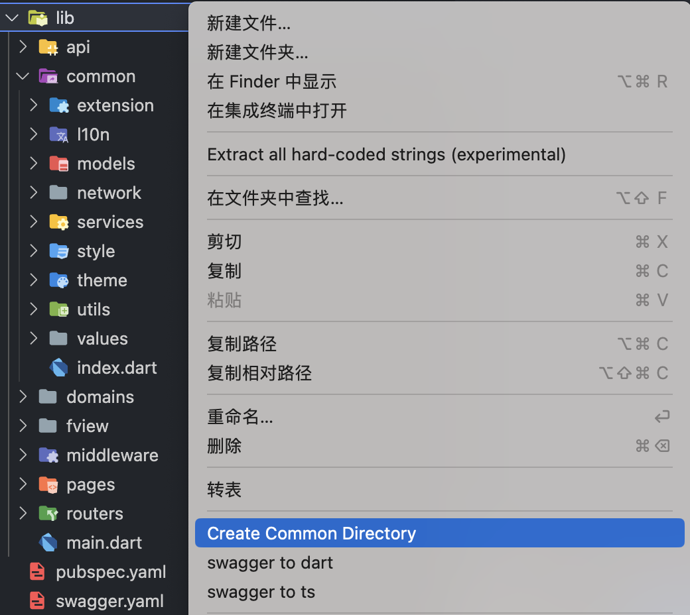
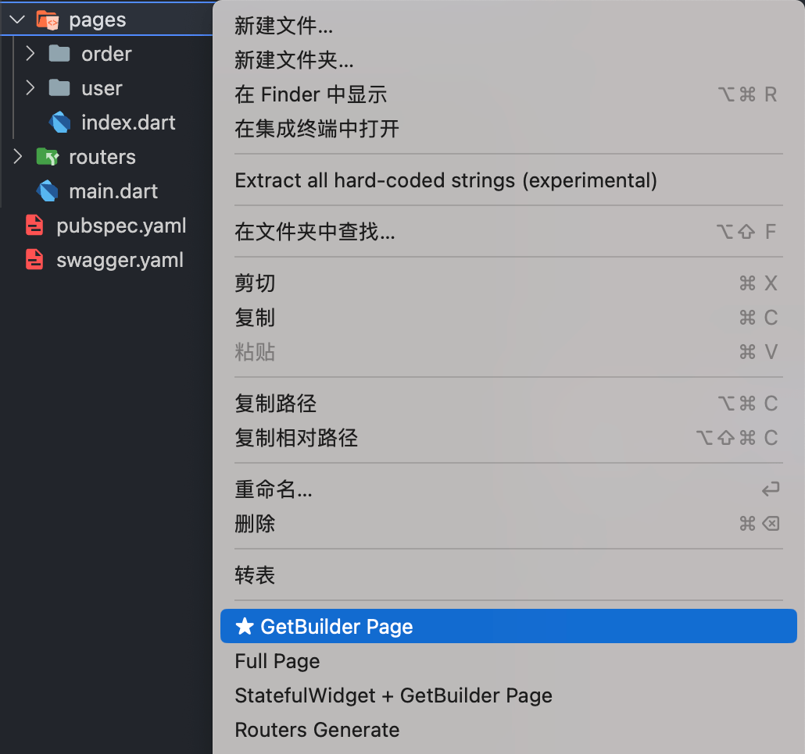
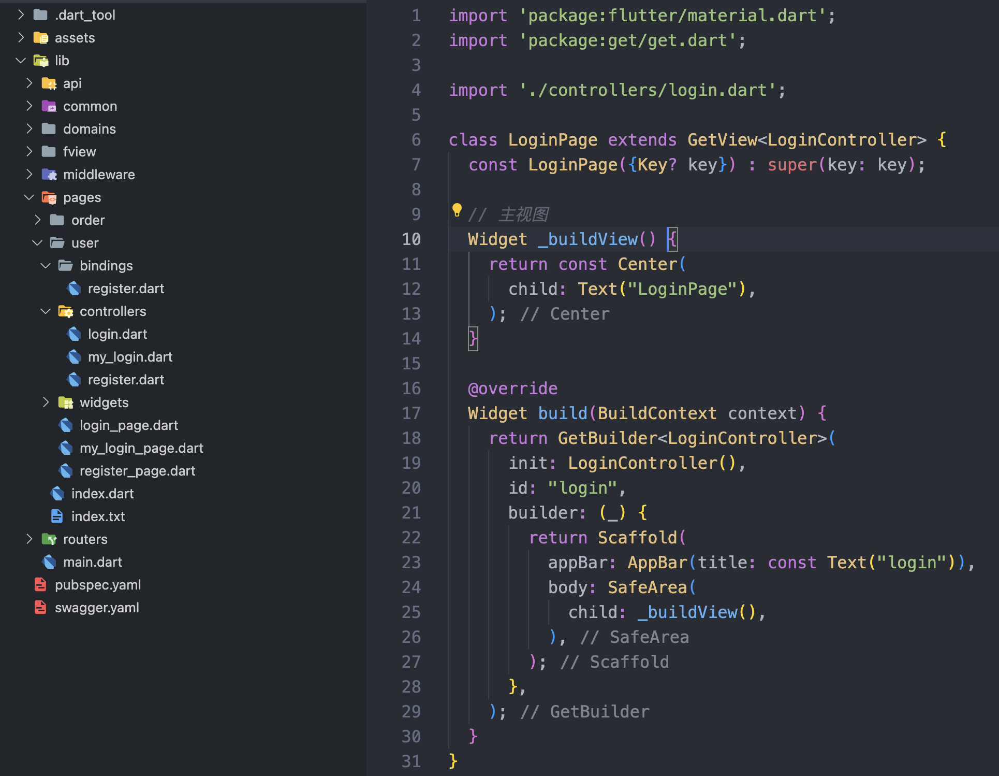
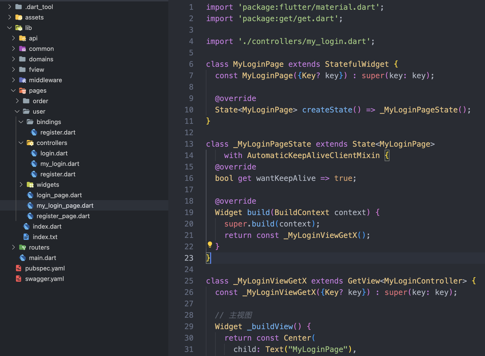
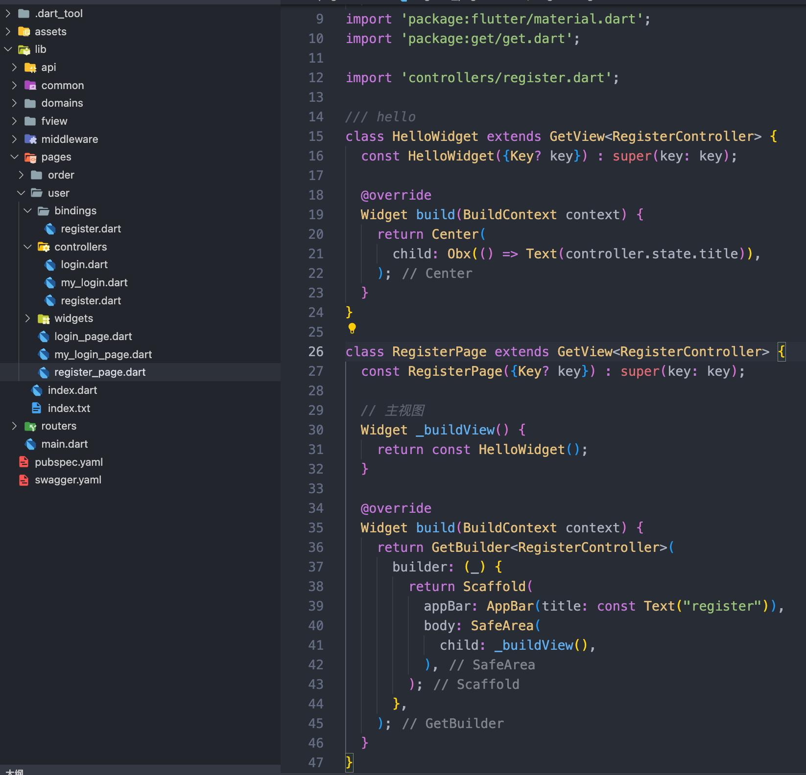
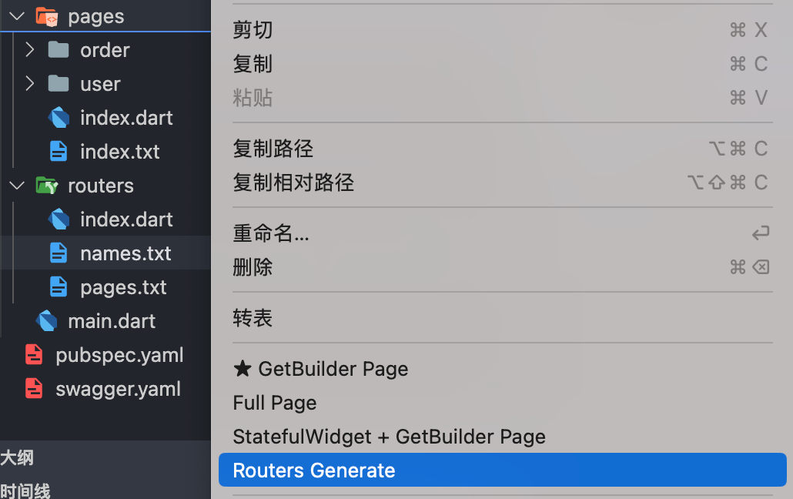

# VG：项目代码生成工具

你需要一个工具来自动生成规范的目录结构和常用页面文件。同时，还需要能够自动生成路由文件，将图片从3.0x转换为1x和2x，以及将Swagger转换为请求和模型格式。这些任务需要自动化完成，你是否已经在寻找现有的工具或库来帮助你完成这些任务呢？

[下载: vg-vscode-extension](https://marketplace.visualstudio.com/items?itemName=jimmyzhao.vg-vscode-extension) - marketplace

# 功能

- [x] 1. 根据 `x3` 图片自动生成 `x1` `x2` 图片
- [x] 2. getx flutter 
  - [x] 1. 生成规范目录 `common`
  - [x] 2. 生成 `GetBuilder + GetView` 的代码
  - [x] 3. 生成 `StatefulWidget + GetBuilder + GetView` 的代码
  - [x] 4. 生成 `controller、view、widgets、bindings、state、index ` 完整的代码
  - [x] 5. 生成 路由声明定义文件
      > common/routers/names.txt  
      > common/routers/pages.txt  
      > pages/index.txt
- [ ] 3. swagger gen
  - [x] 1. swagger to dart
  - [ ] 2. swagger to ts
- [ ] 4. snippets

---
# 使用说明



> 在图片 3.0.x 目录上右键菜单操作

## 1. 根据 x3 图片自动生成 x1 x2 图片

请将你的 `图片`、`Svg` 放到目录

```
assets/images/
assets/svgs/
```

- 准备好你的 `assets/images/3.0x` 图片

- 右键点击菜单 `Assets: Images x1 x2 Generate`

- 成功生成了 `2.0x` 文件夹，和 `1x` 的图片

---

> 生成 `图片` `svg` 常量列表 `files.txt`

点击 `Assets: Images x1 x2 Generate` 同时会生成常量列表文件 `files.txt`

文件位置

```
assets/images/files.txt
assets/svgs/files.txt
```

> 所以你的 `图片` `svg` 要放到指定位置

- 生成 `files.txt` 常量列表



- 如果你把 `svg` 放到 `assets/svgs` 这个目录下，也会生成常量列表

---

## 2. getx ❤️ flutter 

### 1. 生成规范 `common` 目录

   

> 在 lib 目录上右键菜单操作

自动创建开发目录
<!-- extension', 'l10n', 'models', 'network', 'services', 'style', 'theme', 'utils', 'values' -->
```
- common
  - extension
    - index.dart
  - l10n
  - models
  - network
  - services
  - style
  - theme
  - utils
  - values
- domains
  - index.dart
- fview
  - components
    - index.dart
  - utils
  - vendors
  - widgets
- middleware
  - index.dart
- routers
  - index.dart
- pages
  - index.dart
```

---

### 2. 生成 GetBuilder + GetView 的代码



> 在 pages 或 pages 内目录上右键菜单操作

采用了 [page modules]概念组织页面文件

推荐用这种，简单快速，自带自动释放控制器，GetBuilder 方式对性能也好。input name 推荐使用 Case Snake (aa_bb)格式

### 3. 生成 GetBuilder + GetView 的代码



> 采用 `GetBuilder` 手动init Controller、布局控制刷新，性能好，推荐这种。   
> 注意看这个 `id` 属性，需要全局唯一    
> 常用的生命周期函数也生成了，按需要放开注释
> `update(["abc"]);` 采用这种方式触发 `GetBuilder` 的 `id`属性，进行控制刷新

---

### 4. 生成 StatefulWidget + GetBuilder + GetView 的代码



这种是在 GetBuilder + GetView 的基础上，再加入了 StatefulWidget 包裹，比如你需要 mixin 一些功能的时候需要（AutomaticKeepAliveClientMixin、wantKeepAlive）。

> 可以看到 `GetX` 和 `StatefulWidget` 的优雅的结合方式，就是作为组件在 `StatefulWidget.build` 时创建    
> 并不是用了 `GetX` 就不要 `StatefulWidget` 了，很多 `Mixin` 还是需要的

---

### 5. 生成 Full Page 代码



这种方式，包含了全部的 bindings、state、controller、view 拆分的很细致


### 6. 生成 路由声明定义文件

`routers/names.txt` `routers/pages.txt` `pages/index.txt`



> 在 pages 目录上右键菜单操作   
> 好了 拿去复制吧，这样不用自己手写了！

---

## 3. swagger gen

### 1. swagger config init

```json
// vscode command
{
  "title": "swagger config init",
  "category": "VG"
}
```

### 2. swagger to dart
```json
// vscode command
{
  "title": "swagger to ts",
  "category": "VG"
}
```

> 简单做了 swagger2、swagger3 适配 ，主要测试 apifox 导出的 swagger.json   
> 目前根据 `tags` 和 `x-apifox-folder` 生成目录，其他一律放在 api/entitys 或  api/requests 目录下 
> 首次会生成 xxx.g.dart 文件，你也可以做修改。再次生成不会覆盖已有文件，生成一个同名的 xxx.g.vg 文件    

end

大家可以自己动手体验下~

# Release Notes
### 1.0.0

Initial release of ...

# 更多

受 `getx-template`、`swagger-ts-plugin` 的启发，做了些有趣的修改

Dependencies:
- axios    
- change-case   
- jimp   
- lodash   
- md5   
- mkdirp   
- yaml   
